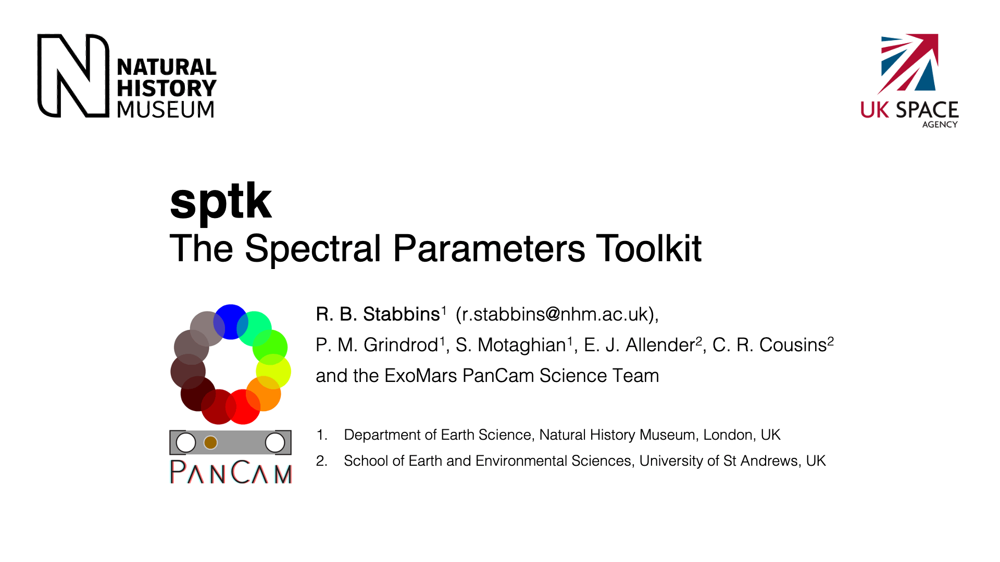

<p align="center">
  <a href="" rel="noopener">
 </a>
</p>

<h3 align="center">sptk: The Spectral Parameters Toolkit</h3>

<div align="center">

[]()
[](https://github.com/rbstabbins/sptk/issues)
[](https://github.com/rbstabbins/sptk/pulls)
[](/LICENSE)

</div>

---

<p align="center">
<strong>sptk</strong> is a Python library for investigating the ability of a multispectral imaging system to identify distinct materials and material groups through differences in reflectance spectra.
    <br>
</p>

## Table of Contents

- [About](#about)
- [Installing](#installing)
- [Usage](#usage)
- [TODO](../TODO.md)
- [Contributing](../CONTRIBUTING.md)
- [Authors](#authors)
- [Acknowledgments](#acknowledgement)

## About <a name = "about"></a>

**sptk** provides a simple interface for:
* simulating the spectral response of an instrument,
* sampling a spectral library with the instrument,
* measuring the reconstruction error of the instrument on the spectral library,
* evaluating the spectral parameters afforded by the instrument,
* evaluating and ranking the ability of the spectral parmameters, and spectral parameter combinations, to separate categories of materials.

The ranking of spectral parameter combinations employs the method of 'Supervised Spectral Parameter Learning', as described in the paper Stabbins et al., submitted to Earth & Space Science (2024).
This uses Linear Discriminant Analysis to evaluate all possible spectral parameter pair combinations in their ability to separate the classes of a labelled dataset of material reflectance spectra.

The method of the paper is demonstrated in the accompanying notebook, "Detecting Hematite at Oxia Planum with the ExoMars PanCam Filter Suite", that can be found here [link to notebook repository].

## Installing <a name = "installing"></a>

```sptk``` is available via PyPI. We recommend downloading a copy of the [https://github.com/rbstabbins/sptk](https://github.com/rbstabbins/sptk) repository, and using this as a base directory for running ```sptk``` projects. We also recommend downloading a copy of the [ESS Paper Dataset](ESS Paper Dataset) to use as input data. This hosts the spectral library and instrument data used in the Stabbins et al 2024 paper.

### Prerequisites

What things you need to install the software and how to install them.

```
Give examples
```

### Installing

A step by step series of examples that tell you how to get a development env running.

Say what the step will be

```
Give the example
```

And repeat

```
until finished
```

End with an example of getting some data out of the system or using it for a little demo.

## Running the tests <a name = "tests"></a>

Explain how to run the automated tests for this system.

## Usage <a name="usage"></a>

Each major step is described in the notebooks found in the 'examples' directory.

## Authors <a name = "authors"></a>

- [@rbstabbins](https://github.com/rbstabbins) - Idea & Initial work

See also the list of [contributors](https://github.com/rbstabbins/sptk/contributors) who participated in this project.

## Acknowledgements <a name = "acknowledgement"></a>

- ViSOR: M. Rice, M. St. Claire, C. Million
- pysptools
- spectral
